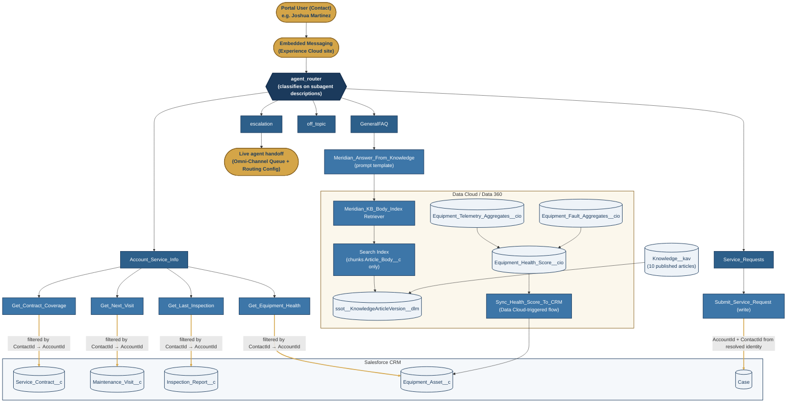

# Meridian Building Solutions: Agentforce Portfolio

## What this is

**Meridian Building Solutions** is a mock mid-market commercial HVAC and building automation company, built out end-to-end in a free Salesforce Agentforce + Data Cloud (Data 360) Developer Edition org as a portfolio piece. This repo holds the first two projects of a three-project arc, both complete.

**Project 1** is a customer-facing **Agentforce Service Agent** deployed on an authenticated Experience Cloud portal. Logged-in customers (facility managers, building engineers) ask it about their service contract coverage, upcoming maintenance visits, technicians, inspection results, and equipment health, get general how-does-this-work answers grounded in a Knowledge base, and can submit non-urgent service requests directly through the conversation. It is the subject of the architecture diagram and design notes below.

**Project 2** is an internal **Renewal Prep Agent** for account executives, covered in its own section further down.

Together they exist to demonstrate real Agentforce + Data Cloud build skills (agent design, custom action flows, RAG grounding, and Calculated Insights) to engineers and hiring managers evaluating that experience, not to run an actual business.

## Architecture

_Gold edges trace the identity/security boundary. The `ContactId → AccountId` filter is the only thing standing between a portal user and another customer's data (see below). Cylinders are data at rest; the hexagon is the routing decision point; rectangles are process/action steps._

The Knowledge grounding path (bottom-left of the Data Cloud box) and the Equipment Health Score write-back path (bottom-right) are independent Data Cloud pipelines that both land back in the CRM objects the agent's action flows read: Knowledge indirectly through the retriever, equipment health directly through the CI write-back flow. Data Cloud also holds a separate three-stage `Account_Risk_Score__cio` pipeline (`Account_Portal_Aggregates__cio` + `Account_Case_Aggregates__cio` → `Account_Risk_Score__cio`), the primary input for Project 2. That architecture is omitted from the diagram above, which covers Project 1 only.

## Project 1 design decisions and tradeoffs

### ⭐ Identity and security model

Action flows run **as the portal user** (confirmed via flow debug log, not the auto-provisioned Agentforce service-agent user), but in **system context without sharing ("Access All Data")**, because the portal user's own profile has no access to the custom objects at all. That means there is no sharing layer sitting behind these flows. **The in-flow `ContactId → AccountId` filter, derived solely from the authenticated session, is the entire security boundary.**

This was chosen deliberately over the alternative (granting the portal user direct object access plus sharing sets) for two reasons:

- **Customer Community Plus has a known defect** where child records granted via a sharing set on the parent don't cascade down the hierarchy (Account → Site → Equipment → Visits/Inspections here). System-context flows sidestep it entirely instead of fighting it.
- It keeps the portal user's own object access minimal, so a future loosening of org-wide defaults can't accidentally expose other accounts' data. Every read of account-scoped data goes through one auditable filter instead of being spread across a sharing model.

The flows were built with a defensive three-tier identity resolution (`ContactIdInput` bound to a messaging session variable → `$User.ContactId` → a test fallback), but in production `MessagingEndUser.ContactId` is null for this channel type (authenticated site login and verified messaging identity are separate concepts), so **`$User.ContactId` is the actual production path**. The third tier (`TestAccountId`/`TestContactId` inputs) was **deliberately removed** once the no-sharing model was in place, because under no-sharing they amounted to a live "set any account, read any account" bypass with no guardrail behind them. They must never be reintroduced to any new action flow.

**Correction on scope of that guarantee:** an earlier version of the design doc claimed portal users have "zero direct object access." That's no longer literally true. The portal profile was later granted object read plus field-level security on `Knowledge__kav` (specifically `Article_Body__c` and `Category__c`), so an interviewer could catch a "zero access" claim that doesn't hold up. The accurate framing: _portal users have no access to any account-scoped object: contracts, equipment, visits, inspections all route through account-scoped flows in system context. The one direct grant is Knowledge, which is deliberately non-account-specific, since the same ten articles are visible to every customer, so there's nothing to scope and no sharing model to get wrong by granting it._

**Project 2's scoring data is unreadable to portal users, and the profile states it explicitly.** All eight `Account` risk fields (`Account_Risk_Score__c`, the three `Risk_*_Points__c` components, the three `*_Scored__c` inputs, and `Risk_Score_Last_Synced__c`) carry `readable: false` and `editable: false` on the Meridian Portal Customer profile. This matters because the two projects share the Account object: the renewal agent writes a risk score onto the same records the portal agent reads from. Field-level security is what keeps internal scoring out of the customer-facing path, and it is a checkable artifact in the profile rather than a claim.

### ⭐ Staged Calculated Insights, to avoid a JOIN fan-out

This org's two major Data Cloud metrics, Equipment Health Score and Project 2's Account Risk Score, are both built as **three staged Calculated Insights** rather than one. For Equipment Health Score: `Equipment_Telemetry_Aggregates__cio` (999 rows, one per monitored unit) and `Equipment_Fault_Aggregates__cio` (881 rows) each pre-aggregate their own high-volume source independently, and a third CI (`Equipment_Health_Score__cio`) reads both staged outputs and combines them.

The reason is a **JOIN fan-out problem**: telemetry has 29,970 raw readings and faults have 1,490 raw events across 999 to 1,181 pieces of equipment. Joining those two high-volume, high-cardinality sources directly in a single CI multiplies rows incorrectly before aggregation ever happens. Aggregating each source down to one row per equipment first, then joining the two already-aggregated stage tables, avoids the fan-out entirely. The tradeoff is more CIs to build, publish, and keep in sync. That's accepted because getting the row multiplication wrong would silently corrupt the health score.

### ⭐ Agentforce Data Library abandoned in favor of a manual search index

Knowledge grounding was first built on the low-code **Agentforce Data Library (ADL)** path, then abandoned. The ADL auto-chunks multiple Knowledge fields at once (title, URL name, summary, article number, body) with no field-level control: attempting to restrict it to "body only" does nothing. In practice this produced thin title-only and metadata-only chunks alongside real body chunks, and because a bare title chunk is a near-perfect embedding match for a title-shaped query (e.g. "how do I submit a service request"), **the content-free chunks routinely outranked the real content**.

The fix was to build the search index manually via **Data 360 → Search Index → Advanced Setup**, which has an explicit "Select Fields to Chunk" step, used here to chunk `Article_Body__c` only. That produced exactly 10 clean chunks (one per article), with the correct article ranking #1 on every probe question tested. One extra gotcha worth flagging: the ADL reuses an existing search index whenever a new library shares the same identifying fields, so simply re-running the ADL setup kept returning the same broken chunks. The old ADL and its retriever/index/chunk DMOs had to be deleted outright before the manual index would take over cleanly.

### ⭐ Custom actions over the standard query/summarize actions

Per Salesforce's own guidance for public-facing agents, this build uses **five purpose-built Flow actions** (`Get_Contract_Coverage`, `Get_Next_Visit`, `Get_Last_Inspection`, `Get_Equipment_Health`, `Submit_Service_Request`) instead of the platform's generic query/summarize actions. Each one is deterministic, scoped to exactly the fields and objects it needs, account-scoped by construction (see the identity model above), and independently testable. A prompt can't redirect a purpose-built flow into querying an arbitrary object or field the way it could a generic "query records" action.

This also sidesteps a specific fragility in the standard tooling: the out-of-the-box `AnswerQuestionsWithKnowledge` action depends on a RAG/Data Library configuration reference, and if that library is ever deleted, the action fails silently with no error surfaced to the builder. Grounding `GeneralFAQ` on a custom prompt template bound to a specific retriever, rather than the standard knowledge action, avoided that same class of silent failure.

### Other notable decisions

- **The Agentforce router classifies on subagent _descriptions_ only.** Instructions written into a subagent are never read at routing time. Getting the description wording right (e.g. `GeneralFAQ` explicitly claims "how to submit a request" questions, `Account_Service_Info` owns possessive "my record" questions) was the single biggest source of routing bugs during the build.
- **Case creation defaults are hardcoded, not LLM-set**: `Priority` is fixed at `Low` so customer insistence can't inflate routing priority, and `Type` is left for human triage since trade classification isn't something a customer can self-diagnose.
- **Emergency vs. insistence guardrails were tuned after a real test failure** where "extremely urgent" phrasing over-escalated a comfort complaint. Only explicit safety hazards (no heat/cooling in a critical space, gas/refrigerant leak, water intrusion, smoke) redirect to the emergency line without writing a Case; urgency language alone does not.

## Project 2: Renewal Prep Agent

An **internal** agent for account executives, not a customer-facing one. It answers two things: what is in my book of business right now, and prepare me for this specific renewal. Two actions back it, both Flow-targeted:

- `Get_My_Renewals` returns the AE's pending renewals, sorted by soonest expiry, one block per contract with tier, value, margin, notice window, and a risk read. The AE is identified from the logged-in user, so the action cannot be pointed at someone else's book.
- `Prep_Renewal_Brief` takes an account name and produces either an internal renewal brief or a customer-facing email draft, depending on a boolean the agent sets from the user's phrasing.

The brief pulls from CRM (`Service_Contract__c`, `Maintenance_Visit__c`, `Case`, `Contact`) and reads two Data Cloud DMOs directly in the same flow (`ERP_AR_Aging_DMO__dlm` for receivables, `CSR_Call_Log_DMO__dlm` for support call sentiment), filtered on the account's ERP customer id.

### ⭐ The customer-safe payload is a separate build, not a filtered one

One flow assembles two independent text blocks. `txt_ServiceSection` is the internal picture: contract margin, risk score, AR status and credit hold, satisfaction ratings, emergency callout counts, negative-sentiment support calls. `txt_OutreachData` is built separately and contains only facts that are safe to say to a customer.

The distinction matters because the obvious alternative is to hand over everything and instruct the model not to mention margin. That is a wording mitigation, and wording mitigations fail eventually. Building a second payload that never contains the field is a control: **the model cannot misrepresent a field it was never given.** Fields were removed from the outreach payload as specific failure modes appeared, including preventive maintenance delivery counts (a delivered-versus-contracted comparison reads as an accusation either direction) and emergency callout counts.

### ⭐ Both raw payloads are hidden from the reasoning model

The prompt templates are invoked **inside the flow**, not by the agent, so generation happens where the data already is. The two data outputs (`var_Output`, `var_OutreachData`) are then marked `filter_from_agent: True`, meaning the reasoning model never receives them at all. It only ever sees the finished `var_BriefText` or `var_OutreachText`, plus a `var_Status` string telling it whether the account search resolved cleanly, was ambiguous, or found nothing.

This is defense in depth over the same boundary: the customer-safe payload is scoped by construction, and the internal payload is structurally out of reach of the component most likely to leak it.

### ⭐ A risk score of zero is not evidence of a healthy account

`Account_Risk_Score__cio` scores portal engagement, open cases, and payment behavior. It does not measure service delivery, and nothing in the score's name says so.

This surfaced on a real account scoring 0 that simultaneously had negative-sentiment support calls on record, visits scheduled and not attended, and preventive maintenance delivered far in excess of the contracted entitlement. The triage line for it read "no significant risk signal," which is exactly the wrong sentence to put in front of an AE walking into that conversation.

The fix went into the **flow**, not the prompt, because `Get_My_Renewals` output reaches the agent with no template in between and there is nothing downstream to catch it. The zero branch now reads "no risk signal from portal, cases, or AR (service delivery not scored)". The brief's prompt template carries a matching instruction: name the largest contributing component unless every component is zero, and never present a zero score as evidence the account is fine.

### Other notable decisions in Project 2

- **Preventive maintenance visits are two record types, not one.** "PM visits" means Preventive Maintenance plus Quarterly Tune-up, and treating it as a single value undercounts delivery. The same shape appears in call sentiment, where "negative" covers both `Negative` and `Very Negative`.
- **Only negative-sentiment calls are itemised in the brief.** Neutral and positive calls are counted, not listed. An AE preparing for a renewal conversation needs the exceptions, not a transcript index.
- **The triage list rounds annual contract value to whole dollars** (`$89,228`, not `89,228.1`). It is a ranking view, so precision there costs scanning speed and buys nothing. The brief keeps full precision.

## Reading the repository

A full-scope retrieve of this org returns around 880 files, and most of them are Salesforce's rather than Meridian's: stock agents (`Copilot_for_Salesforce`, `EmployeeCopilotPlanner`), default flows and layouts, and auto-generated embedded messaging scaffolding. Those are tracked as they come out of the org.

**Standard fields are the one deliberate exception.** `Account`, `Case`, and `Contact` are pruned to the fields this build actually reads. A Developer Edition org ships a sample schema (`SLA__c`, `UpsellOpportunity__c`, `EngineeringReqNumber__c` and similar) that would otherwise bury the nine custom fields Project 2 depends on. They come back on every wide retrieve and are pruned again rather than committed, so the field directories stay readable as a statement of what matters.

Two things worth knowing when reading the tree:

- **Both agents keep their full version lineage**, Portal Assistant v1 to v5 and Renewal Prep Agent v1 to v7, with matching authoring and planner bundles. The compiled planner bundle is what the runtime actually executes, so the diffs between consecutive bundles are the real record of how each agent changed.
- **`Renewal_Brief` is an orphaned action, kept on purpose.** It is an asset-library `GenAiFunction` pointing straight at the `Meridian_Renewal_Brief` prompt template, left over from before the flow took over template invocation. The live agent does not use it: it reaches the same template through `Prep_Renewal_Brief` and the `Get_Renewal_Brief_Data` flow. Retained as a build artifact rather than deleted.

### What the Metadata API cannot capture

Data Cloud configuration does not retrieve, so none of it is in this repo: DLOs, DMOs and their relationships, Identity Resolution rulesets, Calculated Insight SQL, search indexes, retrievers, refresh schedules, and Data Stream config. That covers every `__cio` insight described above, plus `CSR_Call_Log_DMO__dlm` and `ERP_AR_Aging_DMO__dlm`, which the renewal brief queries directly. The SQL and setup notes live in `data-cloud/` instead, and the caveats there are worth reading before trusting any of it as a current description of the org.
